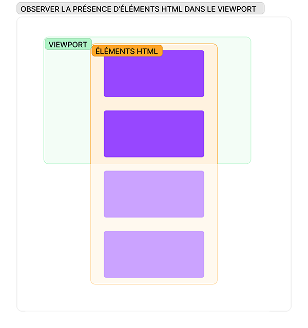
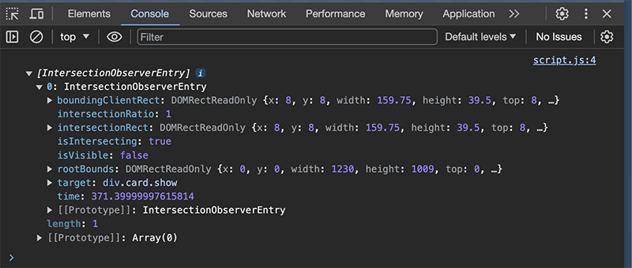
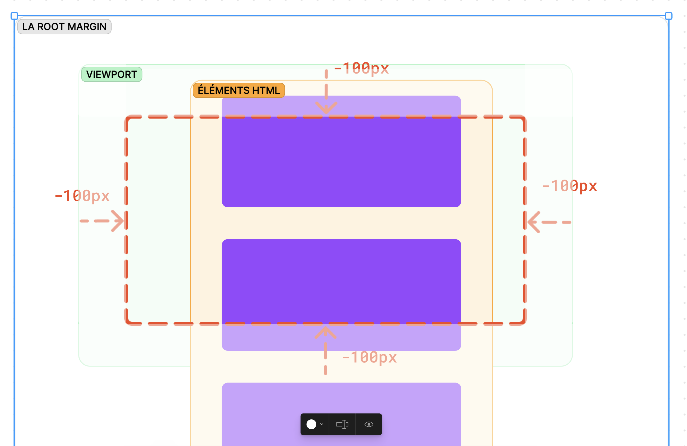

# Intersection Observer

## Code de départ

Structure du projet :

```
.
├── index.html
├── script.css
└── style.css
```

Nous avons une quinzaine de cartes et la première carte a la classe `show` :

```html
<!-- Fichier index.html -->
<!DOCTYPE html>
<html lang="fr-FR">
  <head>
    <meta charset="UTF-8" />
    <meta name="viewport" content="width=device-width, initial-scale=1.0" />
    <title>Comment utiliser Intersection Obsserver</title>
    <link rel="stylesheet" href="style.css" />
    <script src="script.js" defer></script>
  </head>
  <body>
    <!-- .card-container>.card.show{Première carte}+.card{Une carte}*15+.card{Dernière carte} -->
    <div class="card-container">
      <div class="card show">Première carte</div>
      <div class="card">Une carte</div>
      <div class="card">Une carte</div>
      <div class="card">Une carte</div>
      <div class="card">Une carte</div>
      <div class="card">Une carte</div>
      <div class="card">Une carte</div>
      <div class="card">Une carte</div>
      <div class="card">Une carte</div>
      <div class="card">Une carte</div>
      <div class="card">Une carte</div>
      <div class="card">Une carte</div>
      <div class="card">Une carte</div>
      <div class="card">Une carte</div>
      <div class="card">Une carte</div>
      <div class="card">Une carte</div>
      <div class="card">Dernière carte</div>
    </div>
  </body>
</html>
```

Nous avons stylisé ces cartes en les masquant à l’exception de celles qui auront la classe `show` :

```css
/* Fichier style.css */
body {
  background-color: #045;
}
.card-container {
  display: grid;
  gap: 16px;
  overflow-x: hidden;
}
.card {
  font-family: system-ui, -apple-system, BlinkMacSystemFont, 'Segoe UI', Roboto,
    Oxygen, Ubuntu, Cantarell, 'Open Sans', 'Helvetica Neue', sans-serif;
  font-size: 20px;
  background-color: #09f;
  color: #045;
  border-radius: 12px;
  padding: 8px 16px;
  transform: translateX(100px);
  opacity: 0;
  transition: 0.5s;
  height: 100px;
  display: grid;
  align-items: center;
  justify-items: center;
}
.card.show {
  transform: none;
  opacity: 1;
}
```

Nous accédons aux cartes dans le JS et nous les conservons dans un tableau :

```js
// Fichier script.js
const cards = document.querySelectorAll('.card')
```

## Création de l’_observer_

L’_observer_ JS est capable d’_observer_ (de surveiller) des éléments HTML quand ils entrent et sortent d’une zone du _viewport_ :



On crée un _observer_ en fournissant au constructeur `IntersectionObserver` une fonction _callback_. Le paramètre de cette _callback_ est le tableau des éléments HTML que l’_observer_ observera.

Puis on observe un élément en le donnant en paramètre de la méthode `observe()`.

Dans l’exemple ci-dessous on demande à l’_observer_ :

1. d’afficher dans la console du navigateur le tableau des éléments observés qui entrent ou sortent de la zone du _viewport_ observée (ses `entries`)
1. et d’observer la première carte du tableau de `cards` (`cards[0]`) :

```js
// script.js
const cards = document.querySelectorAll('.card')

const observer = new IntersectionObserver((entries) => {
  console.log(entries)
})
observer.observe(cards[0])
```

La console du navigateur affiche maintenant un tableau à chaque fois que la première carte entre ou sort du _viewport_ et ce tableau contient des information sur cette carte



Les informations dont nous disposons sur chacune des `entries` sont :

- l’élément HTML provenant des `entries` (la propriété `target`),
- un booléen nous informant si au moins une partie de l’élément HTML est compris dans la zone observée (la propriété `isIntersecting`),
- les limites rectangulaires de la zone observée (la propriété `rootBounds`),
- les limites rectangulaires de l’élément HTML par rapport à la zone observée (la propriété `boundingClientRect`),
- les limites de la partie rectangulaires de l’élément HTML comprise dans la zone observée (la propriété `intersectionRect`),
- un ratio compris entre 0 et 1 qui indique la proportion de l’élément HTML comprise dans la zone observée par rapport à la surface totale de cet élément HTML (la propriété `intersectionRatio`).

```js
// Exemple des informations affichées par la console du navigateur
{
  boundingClientRect: {
    x: 8,
    y: 8,
    width: 159.75,
    height: 39.5,
    top: 8,
    right: 167.75,
    bottom: 47.5,
    left: 8,
  },
  intersectionRatio: 0,
  intersectionRect: {
    x: 0,
    y: 0,
    width: 0,
    height: 0,
    top: 0,
    right: 0,
    bottom: 0,
    left: 0,
  },
  isIntersecting: false,
  isVisible: false,
  rootBounds: {
    x: 0,
    y: 0,
    width: 1230,
    height: 1009,
    top: 0,
    right: 1230,
    bottom: 1009,
    left: 0,
  },
  target: div.card.show,
  time: 237.30000001192093,
}
```

> Pour en savoir plus : <https://developer.mozilla.org/fr/docs/Web/API/IntersectionObserverEntry>.

## Ajouter la classe `show` aux cartes ou la retirer

Nous allons ajouter la classe `show` aux cartes quand elles sont à l’écran puis leur retirer cette classe quand elles sortent de l’écran.

Pour cela :

- nous itérons les `entries` dans la _callback_ de l’_observer_ avec la méthode `forEach()` pour ajouter à chaque _entry_ la classe `show` si elle est à l’écran ou pour la retirer si elle ne l’est pas,
- nous ajoutons toutes les `cards` du HTML avec la méthode `cards.forEach()`

```js
const cards = document.querySelectorAll('.card')

const observer = new IntersectionObserver((entries) => {
  entries.forEach((entry) => {
    entry.target.classList.toggle('show', entry.isIntersecting)
  })
})
cards.forEach((card) => observer.observe(card))
```

## Pour aller plus loin

Le `threshold` donne des paliers à l’_observer_ pour qu’il réagisse quand il atteint ces paliers. Ces paliers sont des ratio de visibilité des éléments observés.

La `rootMargin` permet de délimiter la zone observée dans le _viewport_ :



Je pourrais ainsi délimiter une zone de 100 px à l’intérieur du _viewport_ :

```js
const cards = document.querySelectorAll('.card')

const observer = new IntersectionObserver(
  (entries) => {
    entries.forEach((entry) => {
      entry.target.classList.toggle('show', entry.isIntersecting)
    })
  },
  { rootMargin: '-100px' }
)
cards.forEach((card) => observer.observe(card))
```

J’affine le processus en utilisant `entry.intersectionRatio` à la place de `entry.isIntersecting`, en donnant le tableau de paliers `threshold` et en donnant trois valeurs (haut, horizontal et bas) au `rootMargin` :

```js
const cards = document.querySelectorAll('.card')

const observer = new IntersectionObserver(
  (entries) => {
    entries.forEach((entry) => {
      entry.target.classList.toggle('show', entry.intersectionRatio >= 0.5)
    })
  },
  { threshold: [0, 0.5, 1], rootMargin: '-10px 100px 0px' }
)
cards.forEach((card) => observer.observe(card))
```
